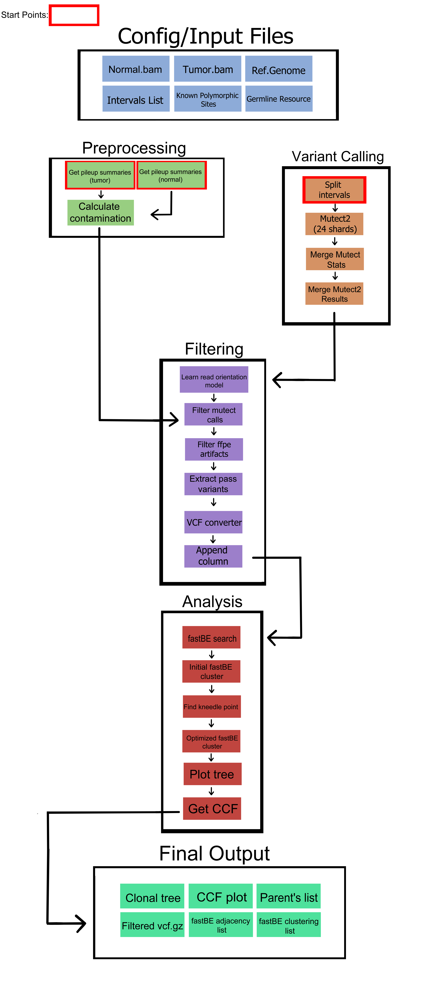

# fastBEST
fastBE supplementary tools (fastBEST) is a [Snakemake](https://snakemake.readthedocs.io/en/stable/) workflow that bundles the generic workflow from variant calling with Mutect2, to clonal denvolution with [fastBE](https://github.com/raphael-group/fastBE). A clonal tree was inferred with fasBE with it's search method, and the variants were clustered with fastBE's cluster method, and the optimal number of clones were inferred with the [kneedle algorithim](https://kneed.readthedocs.io/en/stable/).

------------

# Overview

1. [Setup](#setup)
2. [Overview](#overview)
3. [Usage](#usage)
4. [Outputs](#workflow-output)
5. [Workflow DAG](#workflowDAG)
6. [Citation](#citation)

--------------

# Dependencies

* [conda](https://github.com/conda-forge/miniforge), version >24.1.2
* [Snakemake](https://snakemake.readthedocs.io/en/stable/), version >=7.32.4

---------------

# Setup

This pipeline would require that both [conda](https://github.com/conda-forge/miniforge) and [Snakemake](https://snakemake.readthedocs.io/en/stable/) be installed; ensure bioconda and conda-forge channels are added. Below are the steps to ensure those requirements are met.

1. Install `conda` through [miniforge]((https://github.com/conda-forge/miniforge#install)).
2. Ensure the appropiate conda channels are added;


```
conda config --add channels bioconda
conda config --add channels conda-forge
```

1. Install appropiate [Snakemake](https://snakemake.readthedocs.io/en/stable/):

```
conda create -c conda-forge -c bioconda --name snakemake snakemake
```

---------------

# Overview

Our Snakemake pipeline's main function is to automate variant calling with Mutect2, phylogenetic reconstruction with fastBE, and subsequent analysis with custom-made python scripts to generate cancer cell fraction (CCF) stacked bar chart of the clonal composition of a sample, a phylogenetic reconstructed tree from fastBE outputs, and a fishplot to visualize the evolutionary dynamics of a cohort overtime.

One major advantage Snakemake worklows, along with other workflow management systems is the utilization of a configuration file to generalize a pipeline. We split the workflow to use two configuration files: one config file for samples. This is in the format;

1. `Samples` - the samples dictionary where you will place the path to your input BAM files.
2. `sample_name` - The name of the sample you are analyzing. This will be used to label newly created folders where your outputs will be placed.
3. `sample rows` - First row contains path to `tumor bam files`. Second row holds the `name of normal sample`. Final row is the path to `normal bam file`.

> [!IMPORTANT]
> This workflow is intended for use with tumor-normal samples. If you wish to use a panel of normals, or tumor only: modify rules/mutect2.smk to alter the variant calling shell command.

We used a second configuration file to store other necessary files for this workflow;

1. `Reference Genome`
2. `Intervals List`
3. `Known Polymorphic Sites`
4. `Germline Resources`

The default parameters of this workflow strictly filters the called variants by removig indels, and restricting to only one called variant per loci. Additionally, all C > T, and G > A variants are removed. We strictly filtered the calls due to time complexity we experienced with clonal deconvolution with fastBE. Our initial testing found that the number variants exceeding 2500 typically led to unreasonably long compute times, hence justifying the filtering steps. 

> ![TIP]
> You can manually alter filtering or any other steps in the workflow by modifying or removing specific rules in the workflow/rules folder.


---------------

# Usage

1. Navigate to workflow directory and activate the Snakemake conda environment.

```
cd /path/to/fastBEST directory
conda activate snakemake
```

2. Run a dry-run to test if workflow produces correct outputs

```
snakemake --use-conda --cores <num-ofcpu-cores> -n
```

3. Run the pipeline

```
snakemake --use-conda --cores <num-of-cpu-cores>
```

----------------


# Workflow DAG




---------------

# Citation

For fastbe, please cite the original authors:

```
@article{schmidt2024regression,
  title={A regression based approach to phylogenetic reconstruction from multi-sample bulk DNA sequencing of tumors},
  author={Schmidt, Henri and Raphael, Benjamin J},
  journal={PLOS Computational Biology},
  volume={20},
  number={12},
  pages={e1012631},
  year={2024},
  publisher={Public Library of Science San Francisco, CA USA}
}
```
